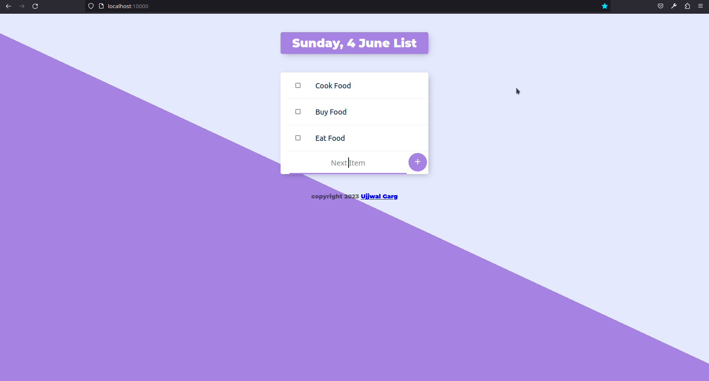
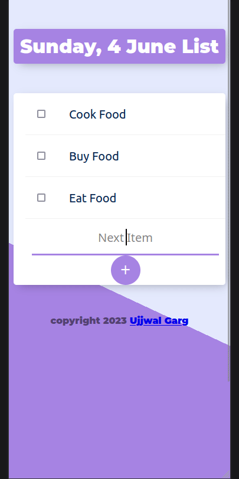

<!-- Project Shields -->

  
  
  
  

<!-- Project Logo -->
 

  

  <h3 align="center">ToDo List Using NodeJS & EJS</h3>

  

    Stay organized with our feature-rich Todo website built with Node.js, TypeScript, Express, and Mongoose, allowing users to seamlessly store and manage their todos, complete with the option to categorize todos by custom names.
     
    <a
      href="https://todo-list-using-nodejs-ejs.onrender.com/"
      aria-label="Link to issues of github repo"
      >
      View Demo
      </a>
    <a
      href="https://github.com/ujjwalgarg100204/todo-list-using-nodejs-ejs/issues"
      aria-label="Link to issues of github repo"
      >Report Bug</a
    >
    ·
    <a
      href="https://github.com/ujjwalgarg100204/todo-list-using-nodejs-ejs/issues"
      aria-label="Link to issues of github repo"
      >Request Feature</a
    >
  

<!-- TABLE OF CONTENTS -->

  
Table of Contents

  <ol>
    <li>
      <a href="#about-the-project">About The Project</a>
      <ul>
        <li><a href="#built-with">Built With</a></li>
      </ul>
    </li>
    <li><a href="#usage">Usage</a></li>
    <li><a href="#contributing">Contributing</a></li>
    <li><a href="#license">License</a></li>
    <li><a href="#links">Links</a></li>
    <li><a href="#author">Author</a></li>
    <li><a href="#acknowledgments">Acknowledgments</a></li>
  </ol>

<!-- ABOUT THE PROJECT -->
<h2>About The Project</h2>
Discover the ultimate Todo website powered by Node.js, TypeScript, Express, and Mongoose. Seamlessly manage your tasks, create personalized todo lists, and effortlessly organize your day. With the ability to assign custom names to your todos, you can tailor your task management experience to your unique preferences, ensuring maximum productivity and efficiency.

#### Desktop Design

  

#### Mobile Design

	 

(<a href="#readme-top">back to top</a>)

<!-- USAGE EXAMPLES -->

## Usage

This application can store multiple Todo lists, with different names. Anyone can access any of the list. It does not show all the lists anywhere, so user has to remember his/her list name.
Once user has their list name, one can simply append to the base link like so

[https://todo-list-using-nodejs-ejs.onrender.com/Work](https://todo-list-using-nodejs-ejs.onrender.com/Work)

or

[https://todo-list-using-nodejs-ejs.onrender.com/work](https://todo-list-using-nodejs-ejs.onrender.com/work)

(<a href="#readme-top">back to top</a>)

<!-- Built With -->

### Built With

<ul>
  <li>
    
  </li>
  <li>
    
  </li>
  <li>
    
  </li>
  <li>
    
  </li>
  <li>
    
  </li>
  <li>
    
  </li>
  <li>
    
  </li>
  
</ul>

(<a href="#readme-top">back to top</a>)

<!-- CONTRIBUTING -->

## Contributing

Contributions are what make the open source community such an amazing place to learn, inspire, and create. Any contributions you make are **greatly appreciated**.

If you have a suggestion that would make this better, please fork the repo and create a pull request. You can also simply open an issue with the tag "enhancement".
Don't forget to give the project a star! Thanks again!

1. Fork the Project
2. Create your Feature Branch (`git checkout -b feature/AmazingFeature`)
3. Commit your Changes (`git commit -m 'Add some AmazingFeature'`)
4. Push to the Branch (`git push origin feature/AmazingFeature`)
5. Open a Pull Request

(<a href="#readme-top">back to top</a>)

<!-- LICENSE -->

## License

Distributed under the MIT License. See `LICENSE.txt` for more information.

(<a href="#readme-top">back to top</a>)

## Links

-   Repo URL: [https://github.com/ujjwalgarg100204/todo-list-using-nodejs-ejs](https://github.com/ujjwalgarg100204/todo-list-using-nodejs-ejs)
-   Live Site URL: [https://ujjwalgarg100204.github.io/todo-list-using-nodejs-ejs](https://ujjwalgarg100204.github.io/todo-list-using-nodejs-ejs)

<!-- AUTHOR -->

## Author

-   Website - [Ujjwal Garg](https://github.com/ujjwalgarg100204)
-   Instagram - [@ujjwalgarg100204](https://www.instagram.com/ujjwalgarg100204/)
-   Linkedin - [@ujjwalgarg100204](https://www.linkedin.com/in/ujjwal-garg-3a5639243/)
-   Twitter -[@UjwalGarg100204](https://twitter.com/UjwalGarg100204)

<!-- ACKNOWLEDGMENTS -->

## Acknowledgments

-   [The Complete Web Development Bootcamp](https://www.udemy.com/course/the-complete-web-development-bootcamp/)

(<a href="#readme-top">back to top</a>)

