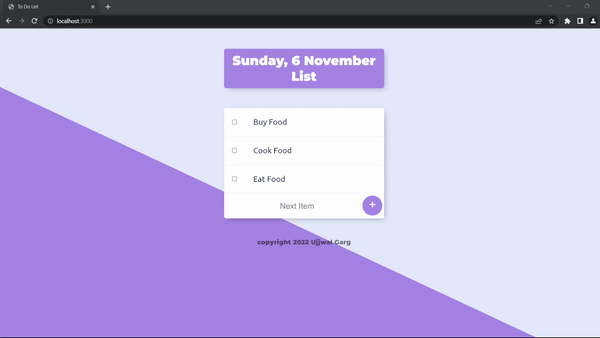
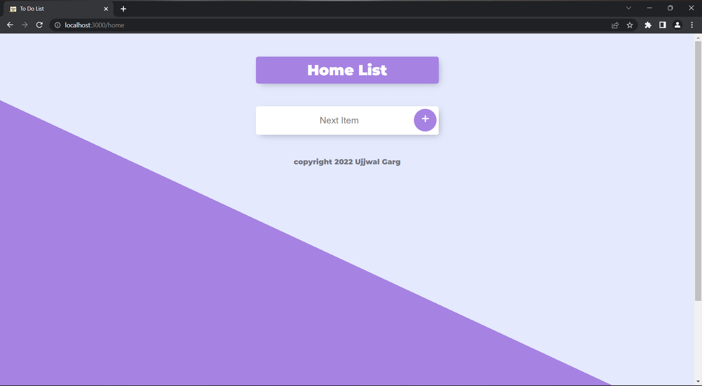

<a name="readme-top" id="readme-top"></a>

<!-- Project Shields -->
<p align="center">
  <a href="https://github.com/ujjwalgarg100204/todo-list-using-nodejs-ejs/network/members"
  >
    
  </a>
  <a
    href="https://github.com/ujjwalgarg100204/todo-list-using-nodejs-ejs/blob/master/LICENSE.txt"
  >
    
  </a>
  <a href=" https://github.com/ujjwalgarg100204/todo-list-using-nodejs-ejs/stargazers">
    
  </a>
  <a href="https://linkedin.com/in/ujjwal-garg-3a5639243">
    
  </a>
</p>

<!-- Project Logo -->
<br />
<div align="center">
  <a href="#">
    
  </a>

  <h3 align="center">ToDo List Using NodeJS & EJS</h3>

  <p align="center" aria-label="Short Description of the project">
    Simple ToDo List application using NodeJS and EJS view rendering
    <br />
    <a
      href="https://github.com/ujjwalgarg100204/todo-list-using-nodejs-ejs/issues"
      aria-label="Link to issues of github repo"
      >Report Bug</a
    >
    ·
    <a
      href="https://github.com/ujjwalgarg100204/todo-list-using-nodejs-ejs/issues"
      aria-label="Link to issues of github repo"
      >Request Feature</a
    >
  </p>
</div>

<!-- TABLE OF CONTENTS -->
<details>
  <summary>Table of Contents</summary>
  <ol>
    <li>
      <a href="#about-the-project">About The Project</a>
      <ul>
        <li><a href="#built-with">Built With</a></li>
      </ul>
    </li>
    <li>
      <a href="#getting-started">Getting Started</a>
      <ul>
        <li><a href="#installation">Installation</a></li>
      </ul>
    </li>
    <li><a href="#usage">Usage</a></li>
    <li><a href="#contributing">Contributing</a></li>
    <li><a href="#license">License</a></li>
    <li><a href="#contact">Contact</a></li>
    <li><a href="#acknowledgments">Acknowledgments</a></li>
  </ol>
</details>

<!-- ABOUT THE PROJECT -->
<h2>About The Project</h2>
Project uses Express JS and Node.JS on the backend to create a server for the application. Whenever any change is made to application and
page needs to be reloaded, it is done so using EJS.
This project does not use any persistent storage, such as MongoDB or SQL database, instead it uses simple JS array to store data that user
generates
<p align="center">
  
</p>

<p align="right">(<a href="#readme-top">back to top</a>)</p>

<!-- GETTING STARTED -->

<h2>Getting Started</h2>

To get started, simply install the project by cloning it and contribute as mentioned in <a href="#contributing">Contribution</a> section

### Installation

1. Clone the repo
   ```sh
   git clone https://github.com/ujjwalgarg100204/todo-list-using-nodejs-ejs.git
   ```
2. Install NPM packages
   ```sh
   npm install
   ```

<p align="right">(<a href="#readme-top">back to top</a>)</p>

<!-- USAGE EXAMPLES -->

## Usage

This application can be used to store three ToDo list simultaneously: default, **Home**, **Work**, which can be accessed by simply appending `work` to
link of the website, such as this

```url
  http://localhost:3000/Work or http://localhost:3000/work
```

<p align="center">
  
  
</p>

<p align="right">(<a href="#readme-top">back to top</a>)</p>

<!-- Built With -->

### Built With

<ul>
  <li>
    <a href="https://www.w3schools.com/html/html_intro.asp">
      
    </a>
  </li>
  <li>
    <a href="https://www.w3schools.com/css/css_intro.asp">
      
    </a>
  </li>
  <li>
    <a href="https://www.w3schools.com/js/js_intro.asp">
      
    </a>
  </li>
  <li>
    <a href="https://expressjs.com/en/starter/hello-world.html">
      
    </a>
  </li>
  <li>
    <a href="https://nodejs.org/en/">
      
    </a>
  </li>
</ul>
<p align="right">(<a href="#readme-top">back to top</a>)</p>

<!-- CONTRIBUTING -->

## Contributing

Contributions are what make the open source community such an amazing place to learn, inspire, and create. Any contributions you make are **greatly appreciated**.

If you have a suggestion that would make this better, please fork the repo and create a pull request. You can also simply open an issue with the tag "enhancement".
Don't forget to give the project a star! Thanks again!

1. Fork the Project
2. Create your Feature Branch (`git checkout -b feature/AmazingFeature`)
3. Commit your Changes (`git commit -m 'Add some AmazingFeature'`)
4. Push to the Branch (`git push origin feature/AmazingFeature`)
5. Open a Pull Request

<p align="right">(<a href="#readme-top">back to top</a>)</p>

<!-- LICENSE -->

## License

Distributed under the MIT License. See `LICENSE.txt` for more information.

<p align="right">(<a href="#readme-top">back to top</a>)</p>

<!-- CONTACT -->

## Contact

Ujjwal Garg - [@linkedin_handle](https://linkedin.com/in/ujjwal-garg-3a5639243) - ujjwalgarg100204@gmail.com

Project Link: [https://github.com/ujjwalgarg100204/todo-list-using-nodejs-ejs](https://github.com/ujjwalgarg100204/todo-list-using-nodejs-ejs)

<p align="right">(<a href="#readme-top">back to top</a>)</p>

<!-- ACKNOWLEDGMENTS -->

## Acknowledgments

- [The Complete Web Development Bootcamp](https://www.udemy.com/course/the-complete-web-development-bootcamp/)

<p align="right">(<a href="#readme-top">back to top</a>)</p>
